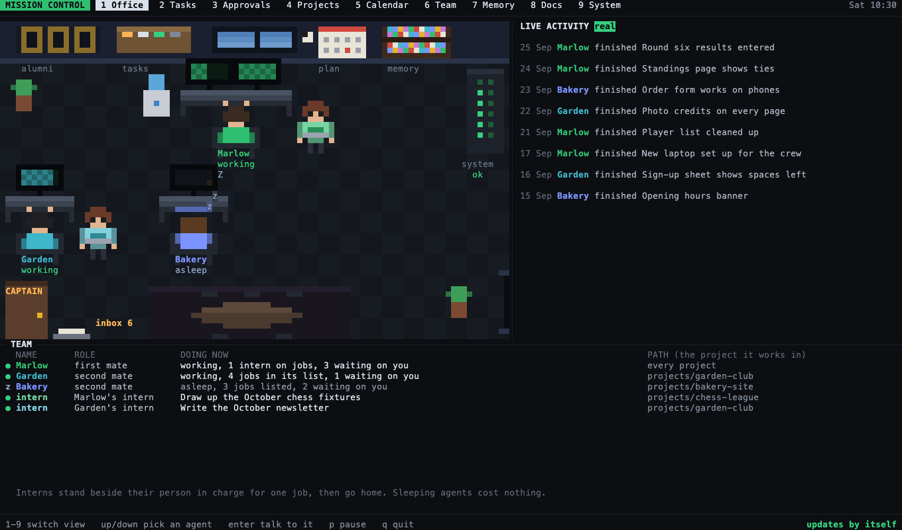
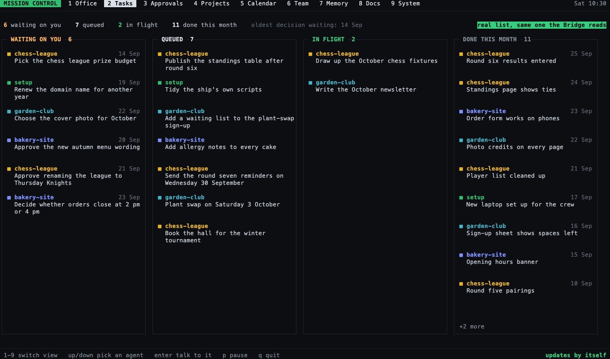
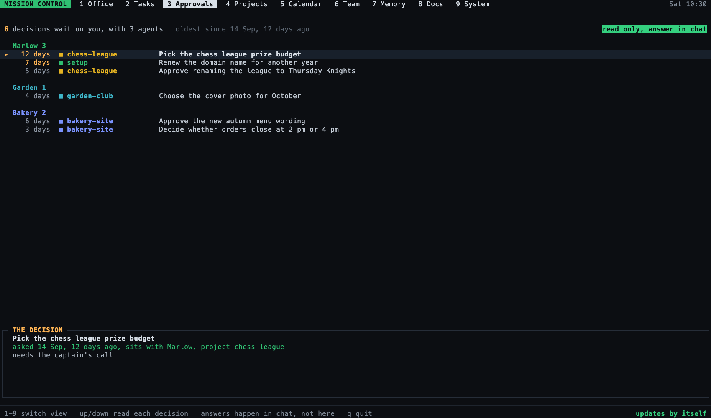
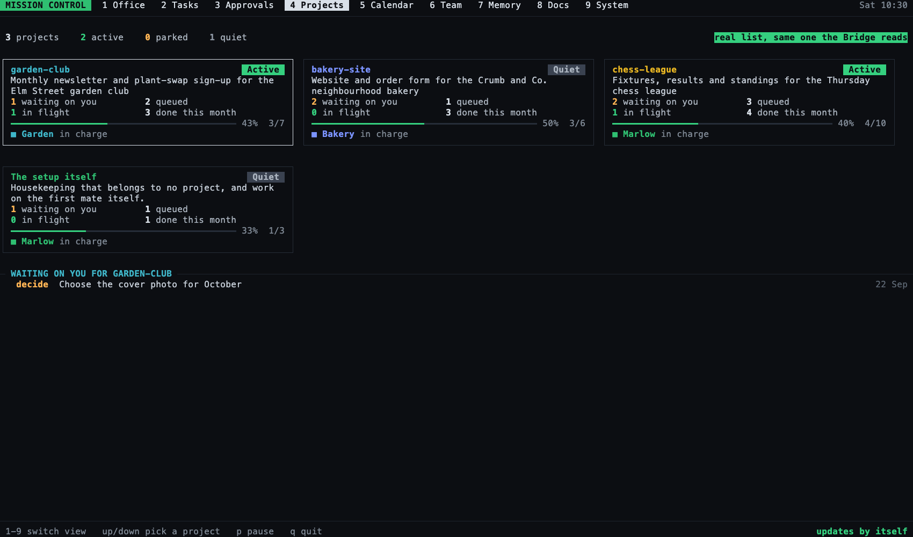
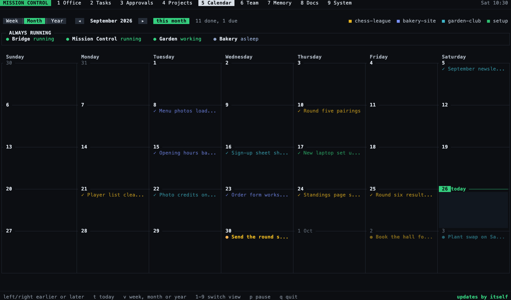
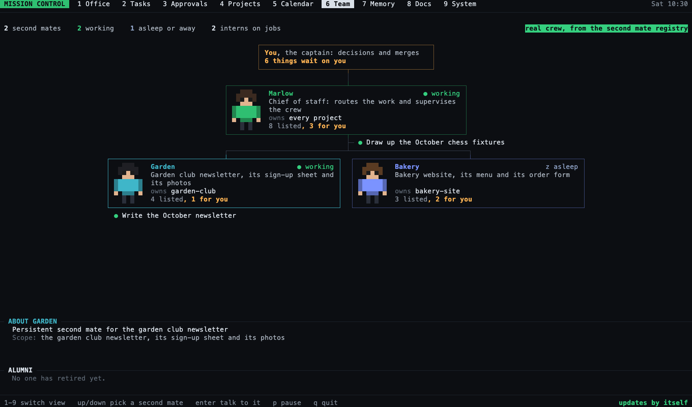
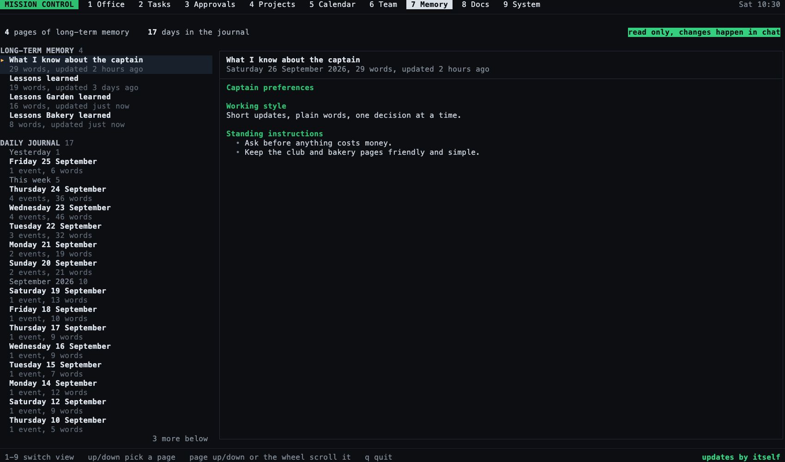
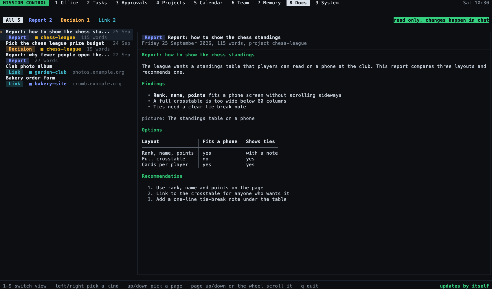
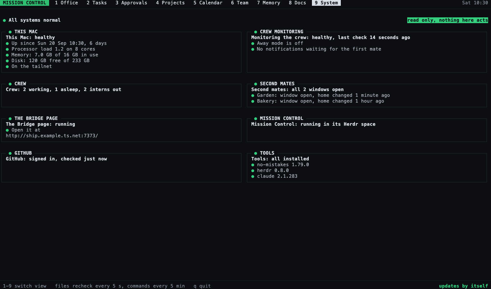
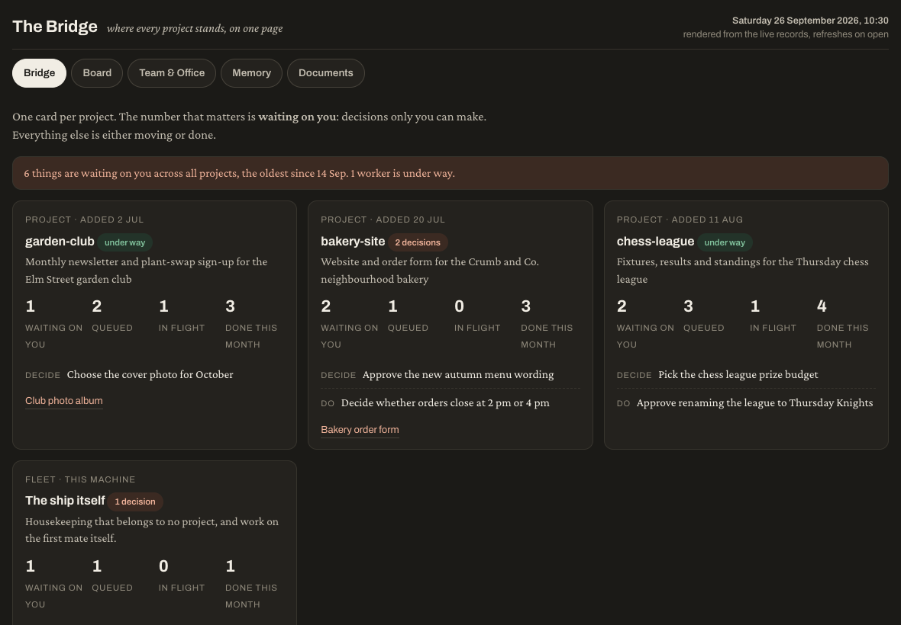

# Mission Control and the Bridge

Mission Control and the Bridge are two ways to watch the whole crew at a glance.
Mission Control is a live screen in a terminal pane, drawn as a pixel-art office with nine views.
The Bridge is a web page with five tabs that you can open on an iPad or phone over Tailscale.
Both only read the crew's records.
Nothing on either one changes a record, answers a decision, or sends anything to an agent; decisions are still answered in chat with the first mate.

The pictures on this page come from a made-up demo crew (a garden club, a bakery and a chess league) at 170 columns by 50 rows.
Your own screen shows your own projects and crew in the same layout.

## Start and stop

You can simply ask the first mate to start, stop or check either one.
The commands below are what it runs.

| What you want | Mission Control | The Bridge |
|---|---|---|
| Start it | `bin/fm-mission-control.sh start` | `bin/fm-bridge.sh install` (starts now and at every login) or `bin/fm-bridge.sh start` |
| Stop it | `bin/fm-mission-control.sh stop` | `bin/fm-bridge.sh stop`, or `bin/fm-bridge.sh uninstall` to stop it starting at login |
| Check it | `bin/fm-mission-control.sh status` | `bin/fm-bridge.sh status`, which also prints the address to open |

Mission Control's `start` opens one Herdr workspace named `mission-control` and runs the screen in it; running `start` again never makes a second copy.
To run the screen in any other terminal, use `bin/fm-mission-control.sh run` and press `q` to leave.
The pane needs at least 96 columns by 36 rows; a smaller pane shows one line asking for more room.

The Bridge listens on this Mac's Tailscale address, port 7373 by default, so any device on your tailnet can open it.
When Tailscale is not running it listens only on this Mac, and `status` says so.

## Moving around Mission Control

| Key or tap | What it does |
|---|---|
| `1` to `9`, or tap a tab | Switch view |
| up and down | Pick the next or previous thing in the view: an agent, a decision, a project card, a second mate or a page; on Tasks, Calendar and System they jump to the Office and pick an agent there |
| Enter | On the Office and Team views, move your Herdr view to the picked agent's pane so you can talk to it; on Approvals, Memory and Docs it does nothing |
| `p` | Pause or restart the office animation |
| `q` | Quit |

Taps work when your terminal reports mouse clicks.
Each view below lists its own extra keys.

## The nine views

### 1 Office

The first mate has the top desk and each second mate has a desk of their own, labelled working or asleep.
Interns, the short-lived workers, stand beside the person in charge of their job.
The inbox by the captain's door counts the decisions waiting on you, and the sign under the server rack reads ok, or check when the System view has something for you to look at.
The column on the right is recent activity in plain sentences, and the team list underneath says what everyone is doing now.
Up and down pick someone in the team list, and Enter moves your view to their pane.

### 2 Tasks

Every open and finished job in four columns: waiting on you, queued, in flight, and done this month.
Each job shows its project in its project's colour.
The counts are the same ones the Bridge shows.

### 3 Approvals

Every decision waiting on you, grouped by the agent who asked, oldest first, with how many days it has waited.
Up and down move the highlight, and the panel at the bottom shows the highlighted decision in full.
No key answers a decision here; you answer in chat.

### 4 Projects

One card per project, plus one for the setup itself, each saying Active, Parked or Quiet.
A card counts what waits on you, what is queued, in flight and done this month, and shows how far along the project is.
Up and down pick a card, and the list below it shows what that project is waiting on you for.

### 5 Calendar

A week, a month or a year of work: finished items are dimmed with a tick, and items that are due are bright with a dot.
The strip at the top shows what always runs: the Bridge, Mission Control and each second mate.
Left and right move a week, month or year, `t` returns to today, and `v` cycles Week, Month and Year.
You can also tap Week, Month or Year, the arrows either side of the date, and "back to today" when it shows; in Year, tapping a month opens it.

### 6 Team

The crew as an org chart: you at the top, then the first mate, then a card for each second mate, with each busy intern under its person in charge.
Each card says whether that agent is working or asleep, which projects it owns, and how many of its jobs wait on you.
Up and down pick a second mate, whose description shows underneath, and Enter moves your view to that mate's pane.
The alumni row lists mates that retired while the screen was open.

### 7 Memory

On the left, the crew's long-term memory (what it knows about you and the lessons each home has learned) and a daily journal built from each day's finished and new work.
On the right, the picked page.
Up and down pick a page, tapping a row picks it, and Page Up, Page Down or the mouse wheel scroll the reader.

### 8 Docs

Every report and decision page, newest first, then your saved links, each with its kind and project.
Left and right show only one kind, up and down pick a document, and Page Up, Page Down or the wheel scroll it.
The reader shows headings, lists and tables as text; a picture shows as a "picture:" line with its caption, because a terminal cannot show images.

### 9 System

The health of this Mac and of the crew's plumbing, one card each, with a green, amber, red or grey dot.
The line at the top reads "All systems normal" or names what needs a look.
Files are rechecked every 5 seconds and commands every 5 minutes; anything that cannot be read says "could not be checked" rather than guessing.

## The Bridge

The Bridge has five tabs: Bridge (one card per project), Board (the task columns), Team & Office, Memory, and Documents.
It is rebuilt from the records when you open or refresh it.

## Settings

Both settings files live in this home's `config/` folder and are optional.
`config/mission-control.json` can set `first_mate_name`, the first mate's name on screen; an edit shows without a restart.
`config/bridge.json` sets the Bridge's port, address, first mate name, display names and saved links; the Bridge writes a commented example the first time it runs.
The full command reference is in the headers of `bin/fm-mission-control.sh` and `bin/fm-bridge.sh`.
