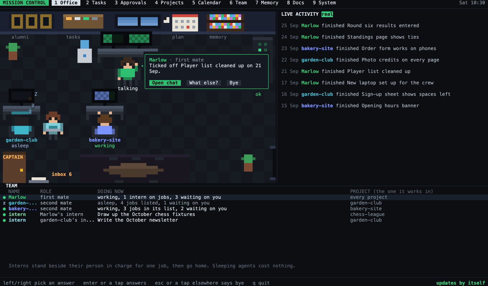

# Mission Control and the Bridge

Mission Control and the Bridge are ways to watch the whole crew at a glance.
Mission Control is a live screen in a terminal pane, drawn as a pixel-art office with nine views.
The Bridge is a web page with five tabs that you can open on an iPad or phone over Tailscale.
The public page is a copy of Mission Control that anyone can open on the web, with everything private left out.
All of them only read the crew's records.
Nothing on any of them changes a record, answers a decision, or sends anything to an agent; decisions are still answered in chat with the first mate.

The pictures on this page come from a made-up demo crew (a garden club, a bakery and a chess league) at 170 columns by 50 rows.
Your own screen shows your own projects and crew in the same layout.

## Start and stop

You can simply ask the first mate to start, stop or check either one.
The commands below are what it runs.

| What you want | Mission Control | The Bridge |
|---|---|---|
| Start it | `bin/fm-mission-control.sh start` | `bin/fm-bridge.sh install` (starts now and at every login) or `bin/fm-bridge.sh start` |
| Stop it | `bin/fm-mission-control.sh stop` | `bin/fm-bridge.sh stop`, or `bin/fm-bridge.sh uninstall` to stop it starting at login |
| Check it | `bin/fm-mission-control.sh status` | `bin/fm-bridge.sh status`, which also prints the address to open |

Mission Control's `start` opens one Herdr workspace named `mission-control` and runs the screen in it; running `start` again never makes a second copy.
To run the screen in any other terminal, use `bin/fm-mission-control.sh run` and press `q` to leave.
The pane needs at least 96 columns by 36 rows; a smaller pane shows one line asking for more room.

The Bridge listens on this Mac's Tailscale address, port 7373 by default, so any device on your tailnet can open it.
When Tailscale is not running it listens only on this Mac, and `status` says so.

## Moving around Mission Control

| Key or tap | What it does |
|---|---|
| `1` to `9`, or tap a tab | Switch view |
| up and down | Pick the next or previous thing in the view: an agent, a decision, a project card, a second mate or a page; on Tasks, Calendar and System they jump to the Office and pick an agent there |
| Enter | On the Office view, the picked agent stands up and talks; on Team it moves your Herdr view to the picked second mate's pane; on Tasks, Projects, Calendar and System it does the same for the agent picked in the Office; on Approvals, Memory and Docs it does nothing |
| Tap an agent | On the Office view, the agent stands up and says one short line, with the answers Open chat, What else? and Bye (see below); on the Team view, move your Herdr view to that agent's pane to open its chat |
| Tap a thing in the office | Open its view: the corkboard opens Tasks, the calendar Calendar, the bookshelf Memory, the server rack System, the inbox Approvals and the alumni wall Team |
| `p` | Pause or restart the office animation |
| `q` | Quit |

Taps work when your terminal reports mouse clicks.
Each view below lists its own extra keys.

## Plain names in Herdr

While Mission Control runs, it also gives Herdr's sidebar plain names, every few seconds.
Each space reads as the agent it belongs to: the first mate's name, each second mate's name, Mission Control and Controls.
Each agent in the agents list shows who it is: the first mate's name, a second mate's name, or "<name>'s intern" after whoever is in charge of the intern (an agent no record claims reads "<name>'s helper").
Its job shows as a second, dimmed line.
A space firstmate still opens for a single intern reads "<name>'s intern · <job>", for example "Denver's intern · BSBA Spec revision 2".
The space firstmate opens its own interns in reads "<name>'s interns", for example "Denver's interns", unless the first mate's own window is in it, so only one space ever reads the first mate's name.
The names come from `config/mission-control.json` (see Settings below).
Herdr shows them only with the sidebar settings in [`herdr-config.toml`](herdr-config.toml): add those lines to `~/.config/herdr/config.toml`, run `herdr config check`, then press Ctrl+B then Shift+R.
Without those settings the sidebar looks as it always has, because the naming step only sets display values.

To name everything once without the screen, run `bin/fm-mission-control.sh names`.
Herdr forgets display values when Herdr itself restarts, so they come back when Mission Control starts again, or at once with Ctrl+B then Alt+N, which those settings bind to the same command.

The naming step only sets display values; it never renames anything.
Every space, tab and window keeps the name it has, so a window you named yourself keeps your name, and firstmate's own names (`fm-`, `2ndmate-`, `firstmate`, `└`) stay as firstmate set them; helper tabs therefore keep firstmate's short job names such as `fm-bsba-rev2`.
It never moves, closes or opens anything, and never touches the crew's records.
`bin/fm_herdr_names.py` has the exact rules.

## The nine views

### 1 Office

The first mate has the top desk and each second mate has a desk of their own, labelled working or asleep.
Interns, the short-lived workers, stand beside the person in charge of their job.
An agent pane that no record claims still shows, as a helper of the mate whose home it works in, or of the first mate, doing what its window title says.
The inbox by the captain's door counts the decisions waiting on you, and the sign under the server rack reads ok, or check when the System view has something for you to look at.
The column on the right is recent activity in plain sentences: work finished, interns and helpers arriving or leaving, second mates joining or retiring, and questions for you.
Who is awake or asleep shows on the desks and in the team list underneath, which says what everyone is doing now, so waking and dozing never crowd the activity column.
Tapping the corkboard, the calendar, the bookshelf, the server rack, the inbox or the alumni wall opens its view.

Tapping a desk, an intern or a row in the team list has that agent stand up and say one short line, like someone in a game: what it is doing now, something it finished lately, or a fun fact that fits its project.
Up and down pick someone in the team list, and Enter does the same.
Open chat moves your Herdr view to its pane, and a chat that has closed says so in one line in the footer.
What else? has it say another line, and Bye, Esc or a tap anywhere else has it sit back down.
Left and right pick an answer and Enter gives it.

### 2 Tasks

Every open and finished job in four columns: waiting on you, queued, in flight, and done this month.
Each job shows its project in its project's colour.
The counts are the same ones the Bridge shows.

### 3 Approvals

Every decision waiting on you, grouped by the agent who asked, oldest first, with how many days it has waited.
Up and down move the highlight, and the panel at the bottom shows the highlighted decision in full.
No key answers a decision here; you answer in chat.

### 4 Projects

One card per project, plus one for the setup itself, each saying Active, Parked or Quiet.
A card counts what waits on you, what is queued, in flight and done this month, and shows how far along the project is.
Up and down pick a card, and the list below it shows what that project is waiting on you for.

### 5 Calendar

A week, a month or a year of work: finished items are dimmed with a tick, and items that are due are bright with a dot.
The strip at the top shows what always runs: the Bridge, Mission Control, the first mate and each second mate.
Left and right move a week, month or year, `t` returns to today, and `v` cycles Week, Month and Year.
You can also tap Week, Month or Year, the arrows either side of the date, and "back to today" when it shows; in Year, tapping a month opens it.

### 6 Team

The crew as an org chart: you at the top, then the first mate, then a card for each second mate, with each busy intern and helper under its person in charge.
Each card says whether that agent is working or asleep, which projects it owns, and how many of its jobs wait on you.
The first mate's card owns every project no second mate has, and the setup itself.
Up and down pick a second mate, whose description shows underneath, and Enter moves your view to that mate's pane.
Tapping a card or an intern's line opens that agent's chat.
The alumni row lists mates that retired while the screen was open.

### 7 Memory

On the left, the crew's long-term memory (what it knows about you and the lessons each home has learned) and a daily journal built from each day's finished and new work.
On the right, the picked page.
Up and down pick a page, tapping a row picks it, and Page Up, Page Down or the mouse wheel scroll the reader.

### 8 Docs

Every report and decision page, newest first, then your saved links, each with its kind and project.
Left and right show only one kind, up and down pick a document, and Page Up, Page Down or the wheel scroll it.
The reader shows headings, lists and tables as text; a picture shows as a "picture:" line with its caption, because a terminal cannot show images.

### 9 System

The health of this Mac and of the crew's plumbing, one card each, with a green, amber, red or grey dot.
The line at the top reads "All systems normal" or names what needs a look.
Files are rechecked every 5 seconds and commands every 5 minutes; anything that cannot be read says "could not be checked" rather than guessing.

## The Bridge

The Bridge has five tabs: Bridge (one card per project), Board (the task columns), Team & Office, Memory, and Documents.
It is rebuilt from the records when you open or refresh it.

## The public page

The public page looks like Mission Control's screen: the same tab bar, office, live activity column and team list.
Office, Projects, Calendar and Team are open to anyone.
Tasks, Approvals, Memory, Docs and System stay in the tab bar with a lock; opening one shows a padlock over blurred shapes, and nothing from those views is ever written into the page.
In the office the corkboard, bookshelf, server rack and inbox carry the same lock, and the wall calendar opens the Calendar.
Tapping someone makes them stand up and say one line, like a character in a game: what they are doing, a count from their projects, or a fun fact.
Its Open chat button is locked, because only you talk to the crew.

The page shows only public facts: the first mate's name, each second mate by its project's name, helpers as "helper for" a project (or "helper for a one-off job" when the project is not registered), roles built only from those names (such as "second mate for" a project), working or asleep, project names and colours, how many items are waiting on you, in flight and done, how many were done or are due on each calendar day, and plain events such as "joins the crew", "calls in a helper for" a project or "finishes a job"; never falling asleep or waking up, which the office already shows.
It never shows task titles, notes, paths, links, email addresses, repository names, the second mates' registered scopes or anything from the crew's memory, reports or decisions.
A project whose repository has no name in `config/mission-control.json` shows as "Project 1", "Project 2" and so on.

The page is a snapshot rather than a live view, so this Mac is never reachable from the internet.
A small job rebuilds it every 5 minutes and sends it to the web only when something changed; the office keeps moving in the visitor's browser in between, so the Mac does no work between runs.
The page says how long ago it was updated.
Because every run rebuilds the page from the current code, improvements to Mission Control reach the public page on its next run.

The page can live on Cloudflare or on GitHub Pages.

### On Cloudflare

The page's code lives on Cloudflare Pages, and the snapshot lives in Workers KV, where a small Pages Function serves it to the page at `/snapshot.json`.
Each run writes the snapshot to Workers KV only when it changed, which stays well inside the free tier's daily writes at 5 minutes.
The page's code is deployed again only when the code itself changed, such as after a Mission Control update, because Pages limits how many deploys a project gets each month.

To set it up once:

1. Create a Cloudflare API token with the Cloudflare Pages Edit and Workers KV Storage Edit permissions.
2. Add it and your account ID to this home's `.env` as `CLOUDFLARE_API_TOKEN=...` and `CLOUDFLARE_ACCOUNT_ID=...`; they are read only from there, never from your shell, so a manual run and the scheduled job use the same ones, and the token is never printed, logged or written anywhere else.
3. Install [wrangler](https://developers.cloudflare.com/workers/wrangler/install-and-update/), Cloudflare's command-line tool, which deploys the page's code.
4. Add `"public_page": {"host": "cloudflare", "project": "mission-control"}` to `config/mission-control.json`, and optionally `"every_minutes"` (5 by default; a larger number saves more power).
5. Run `bin/fm-mission-control-web.sh publish <a folder>` once, with a folder outside this home that the job keeps between runs.
   The first run creates the Pages project and a Workers KV namespace named after it (`mission-control-snapshot`) when they do not exist, and prints the page's address, such as `https://mission-control-xyz.pages.dev`.
6. Run `bin/fm-mission-control-web.sh install <the same folder>` to run it on schedule.

### On GitHub Pages

1. Create a public GitHub repository for the page, for example `your-name/mission-control`, turn on GitHub Pages for its default branch and root folder, and clone it somewhere outside this home.
2. Add `"public_page": {"repository": "your-name/mission-control"}` to `config/mission-control.json`, and optionally `"every_minutes"`.
3. Run `bin/fm-mission-control-web.sh publish <the clone>` once to check it pushes, then `bin/fm-mission-control-web.sh install <the clone>` to run it on schedule.

Each run commits and pushes the page's files only when they changed.

`bin/fm-mission-control-web.sh status` shows the schedule, when the page last changed and where it is published, and `uninstall` stops it.
Run `install` again after changing `every_minutes`.

## Settings

The settings files live in this home's `config/` folder and are optional.
`config/mission-control.json` can set `first_mate_name`, the first mate's name on screen, `names`, the project names every view shows (and so the name each second mate goes by), and `public_page` for the public page; an edit shows without a restart, in Herdr's sidebar too.
`config/bridge.json` sets the Bridge's port, address, first mate name, display names and saved links; the Bridge writes a commented example the first time it runs.
The full command reference is in the headers of `bin/fm-mission-control.sh`, `bin/fm-mission-control-web.sh` and `bin/fm-bridge.sh`.
