# Mission Control and the Bridge

Mission Control and the Bridge are ways to watch the whole crew at a glance.
Mission Control is a live screen in a terminal pane, drawn as a pixel-art office with nine views.
The Bridge is a web page with five tabs that you can open on an iPad or phone over Tailscale.
The public page is a copy of Mission Control that anyone can open on the web, with everything private left out.
All of them only read the crew's records.
Nothing on any of them changes a record, answers a decision, or sends anything to an agent; decisions are still answered in chat with the first mate.

The pictures on this page come from a made-up demo crew (a garden club, a bakery and a chess league) at 170 columns by 50 rows.
Your own screen shows your own projects and crew in the same layout.

## Start and stop

You can simply ask the first mate to start, stop or check either one.
The commands below are what it runs.

| What you want | Mission Control | The Bridge |
|---|---|---|
| Start it | `bin/fm-mission-control.sh start` | `bin/fm-bridge.sh install` (starts now and at every login) or `bin/fm-bridge.sh start` |
| Stop it | `bin/fm-mission-control.sh stop` | `bin/fm-bridge.sh stop`, or `bin/fm-bridge.sh uninstall` to stop it starting at login |
| Check it | `bin/fm-mission-control.sh status` | `bin/fm-bridge.sh status`, which also prints the address to open |

Mission Control's `start` opens one Herdr workspace named `mission-control` and runs the screen in it; running `start` again never makes a second copy.
To run the screen in any other terminal, use `bin/fm-mission-control.sh run` and press `q` to leave.
The pane needs at least 96 columns by 36 rows; a smaller pane shows one line asking for more room.

The Bridge listens on this Mac's Tailscale address, port 7373 by default, so any device on your tailnet can open it.
When Tailscale is not running it listens only on this Mac, and `status` says so.

## Moving around Mission Control

| Key or tap | What it does |
|---|---|
| `1` to `9`, or tap a tab | Switch view |
| up and down | Pick the next or previous thing in the view: an agent, a decision, a project card, a second mate or a page; on Tasks, Calendar and System they jump to the Office and pick an agent there |
| Enter | On the Office and Team views, move your Herdr view to the picked agent's pane so you can talk to it; on Tasks, Projects, Calendar and System it does the same for the agent picked in the Office; on Approvals, Memory and Docs it does nothing |
| Tap an agent | On the Office and Team views, move your Herdr view to that agent's pane to open its chat; a chat that has closed says so in one line in the footer |
| `p` | Pause or restart the office animation |
| `q` | Quit |

Taps work when your terminal reports mouse clicks.
Each view below lists its own extra keys.

## The nine views

### 1 Office

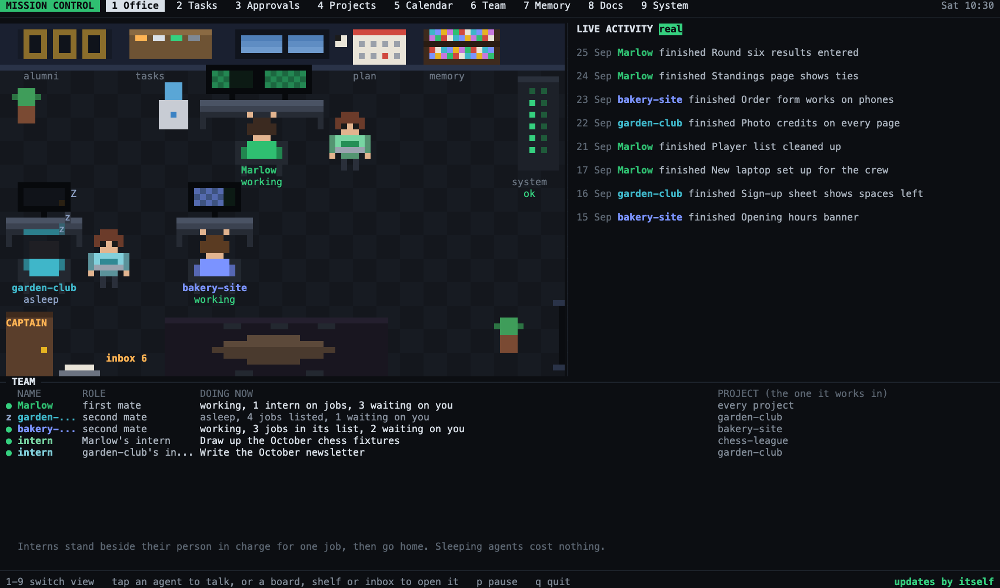

The first mate has the top desk and each second mate has a desk of their own, labelled working or asleep.
Interns, the short-lived workers, stand beside the person in charge of their job.
An agent pane that no record claims still shows, as a helper of the mate whose home it works in, or of the first mate, doing what its window title says.
The inbox by the captain's door counts the decisions waiting on you, and the sign under the server rack reads ok, or check when the System view has something for you to look at.
The column on the right is recent activity in plain sentences, and the team list underneath says what everyone is doing now.
Up and down pick someone in the team list, and Enter moves your view to their pane.
Tapping a desk, an intern or a row in the team list opens that agent's chat.

### 2 Tasks

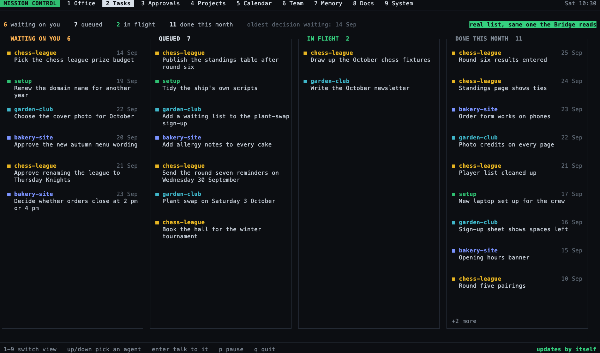

Every open and finished job in four columns: waiting on you, queued, in flight, and done this month.
Each job shows its project in its project's colour.
The counts are the same ones the Bridge shows.

### 3 Approvals

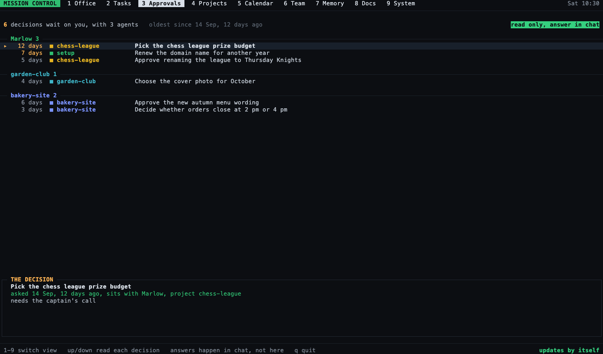

Every decision waiting on you, grouped by the agent who asked, oldest first, with how many days it has waited.
Up and down move the highlight, and the panel at the bottom shows the highlighted decision in full.
No key answers a decision here; you answer in chat.

### 4 Projects

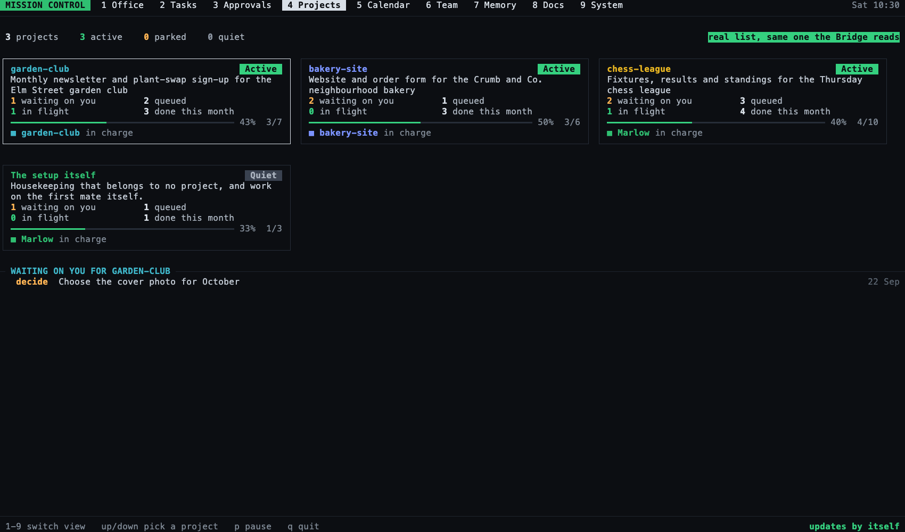

One card per project, plus one for the setup itself, each saying Active, Parked or Quiet.
A card counts what waits on you, what is queued, in flight and done this month, and shows how far along the project is.
Up and down pick a card, and the list below it shows what that project is waiting on you for.

### 5 Calendar

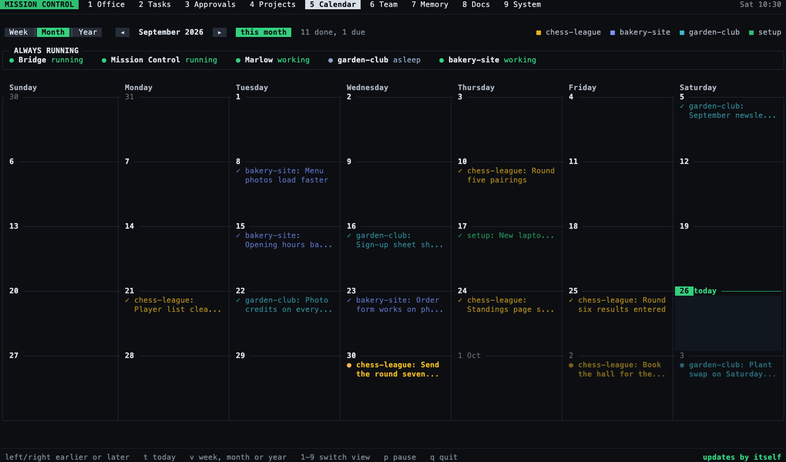

A week, a month or a year of work: finished items are dimmed with a tick, and items that are due are bright with a dot.
The strip at the top shows what always runs: the Bridge, Mission Control, the first mate and each second mate.
Left and right move a week, month or year, `t` returns to today, and `v` cycles Week, Month and Year.
You can also tap Week, Month or Year, the arrows either side of the date, and "back to today" when it shows; in Year, tapping a month opens it.

### 6 Team

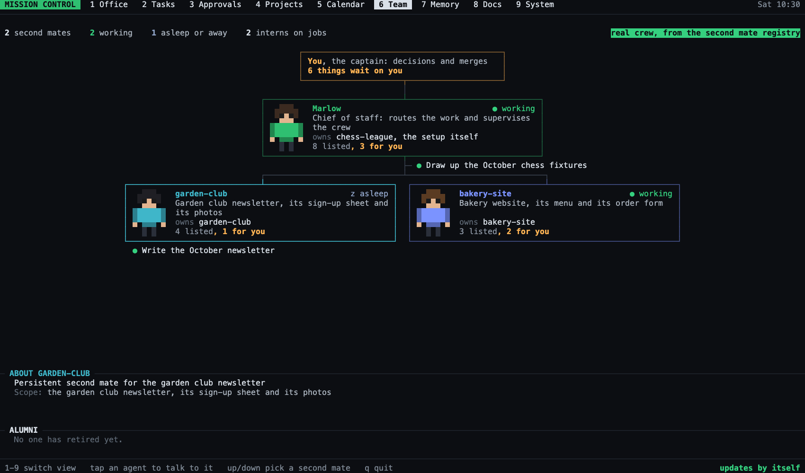

The crew as an org chart: you at the top, then the first mate, then a card for each second mate, with each busy intern and helper under its person in charge.
Each card says whether that agent is working or asleep, which projects it owns, and how many of its jobs wait on you.
The first mate's card owns every project no second mate has, and the setup itself.
Up and down pick a second mate, whose description shows underneath, and Enter moves your view to that mate's pane.
Tapping a card or an intern's line opens that agent's chat.
The alumni row lists mates that retired while the screen was open.

### 7 Memory

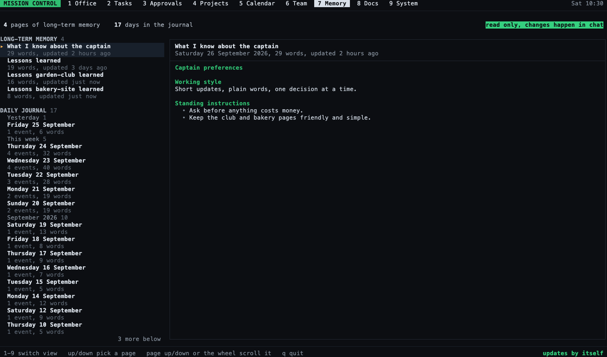

On the left, the crew's long-term memory (what it knows about you and the lessons each home has learned) and a daily journal built from each day's finished and new work.
On the right, the picked page.
Up and down pick a page, tapping a row picks it, and Page Up, Page Down or the mouse wheel scroll the reader.

### 8 Docs

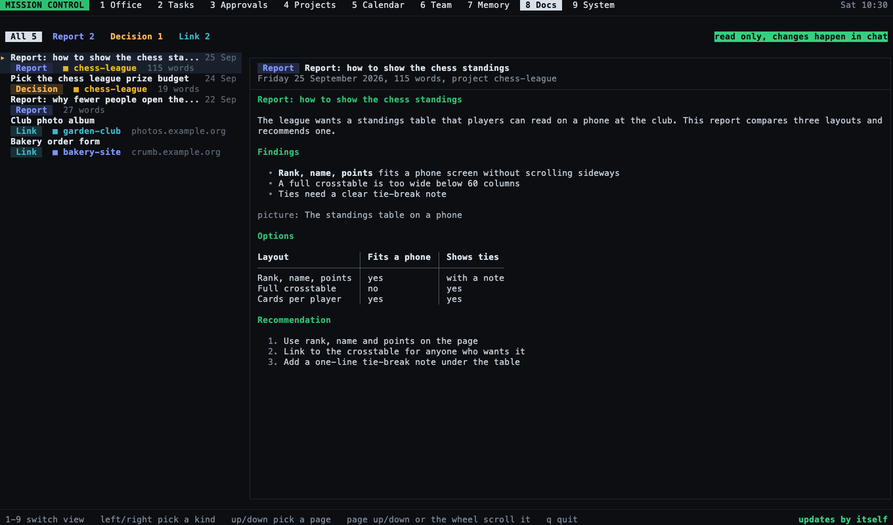

Important links come first, pinned at the top: the System Map, the Bridge page, the public Mission Control page once it is set up, then your saved links from the Bridge's settings, each with its full address printed so you can tap it from Termius.
Every report and decision page follows, newest first, each with its kind and project; the newest one is open when the view first shows.
Left and right show only one kind, up and down pick a document starting from the one open (up reaches the pinned links), and Page Up, Page Down or the wheel scroll it.
The reader shows headings, lists and tables as text; a picture shows as a "picture:" line with its caption, because a terminal cannot show images.

### 9 System

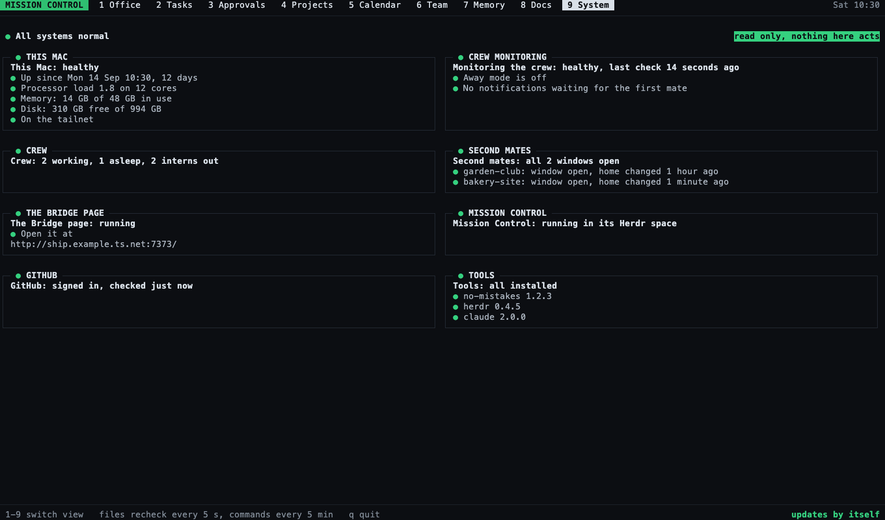

The health of this Mac and of the crew's plumbing, one card each, with a green, amber, red or grey dot.
The line at the top reads "All systems normal" or names what needs a look.
Files are rechecked every 5 seconds and commands every 5 minutes; anything that cannot be read says "could not be checked" rather than guessing.
The System Map card gives the map's full address to open in Safari and the crew's tree in short: you and the ways work arrives, the first mate, each second mate and what it has of its own, the shared tools and the delivery lane.

## The Bridge

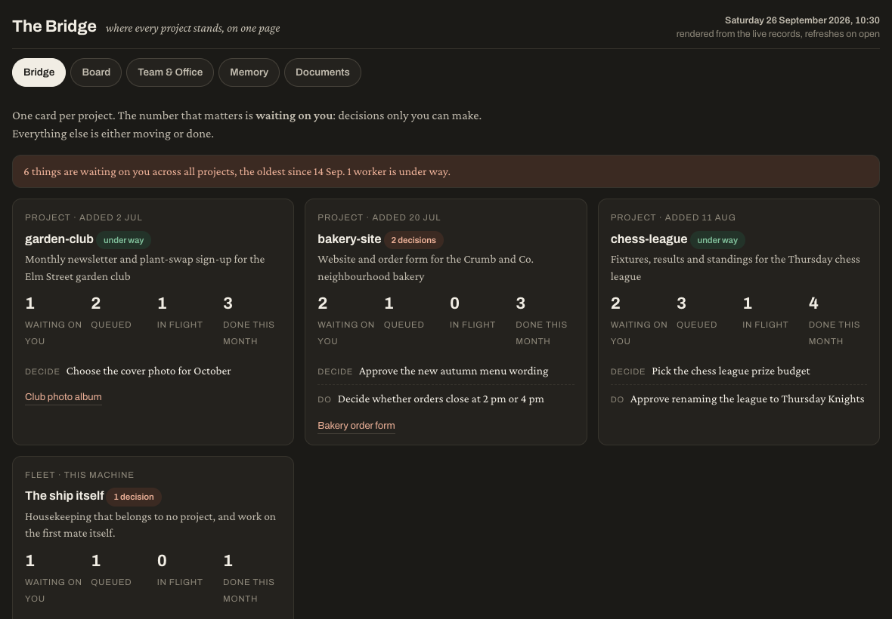

The Bridge has five tabs: Bridge (one card per project), Board (the task columns), Team & Office, Memory, and Documents.
It is rebuilt from the records when you open or refresh it.

### The System Map

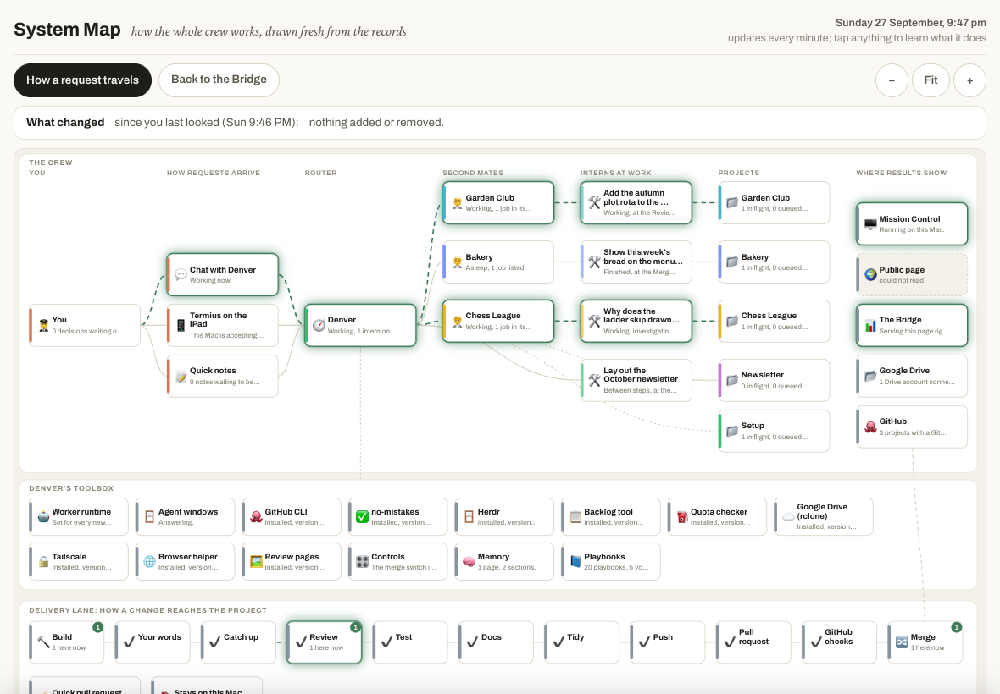

The System Map is a live diagram of how the whole crew works, at `/system-map` on the Bridge's address; the link sits in the Bridge's header.
It reads top to bottom: you and everything that brings work in or wakes the crew (chat, Termius, quick notes, the hooks that run at set moments, the watcher, GitHub results, login items and schedules); the first mate, with where results show beside it; each second mate side by side, with its own model, memory, projects and the tools only it uses hanging beneath it, and its helpers at work; the shared toolbox; and the delivery lane every change travels.
A tool two or more agents use is drawn once in the shared toolbox; tap an agent to light up the lines to the shared tools it uses, or tap a shared tool to see every agent that uses it.
Nothing on it is drawn by hand: every box comes from the crew's records, their settings, their projects' own files and the tools installed on this Mac, so a new second mate, project, dependency, hook, schedule, tool, check or playbook appears by itself, and a box whose source cannot be read says "could not read".
Products show their own logo and everything else a plain line icon.
Whoever is working right now glows, the lines their work flows along move, and each helper sits on its step of the delivery lane; the map refreshes every minute.
Tap any box for a card saying what it is, what it does in the workflow, who uses it and what it is doing now.
"How a request travels" walks one request from you to the merge, one sentence per step, and "What changed" lists what was added or removed since you last opened the map on that device.

## The public page

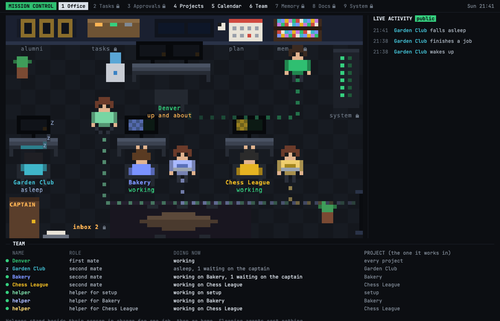

The public page looks like Mission Control's screen: the same tab bar, office, live activity column and team list.
Office, Projects, Calendar and Team are open to anyone.
Tasks, Approvals, Memory, Docs and System stay in the tab bar with a lock; opening one shows a padlock over blurred shapes, and nothing from those views is ever written into the page.
In the office the corkboard, bookshelf, server rack and inbox carry the same lock, and the wall calendar opens the Calendar.
Tapping someone makes them stand up and say one line, like a character in a game: what they are doing, a count from their projects, or a fun fact.
Its Open chat button is locked, because only you talk to the crew.

The page shows only public facts: the first mate's name, each second mate by its project's name, helpers as "helper for" a project (or "helper for a one-off job" when the project is not registered), roles built only from those names (such as "second mate for" a project), working or asleep, project names and colours, how many items are waiting on you, in flight and done, how many were done or are due on each calendar day, and plain events such as "joins the crew", "calls in a helper for" a project or "finishes a job"; never falling asleep or waking up, which the office already shows.
It never shows task titles, notes, paths, links, email addresses, repository names, the second mates' registered scopes or anything from the crew's memory, reports or decisions.
A project whose repository has no name in `config/mission-control.json` shows as "Project 1", "Project 2" and so on.

The page is a snapshot rather than a live view, so this Mac is never reachable from the internet.
A small job rebuilds it every 5 minutes and pushes it to a GitHub Pages repository only when something changed; the office keeps moving in the visitor's browser in between, so the Mac does no work between runs.
The page says how long ago it was updated.
Because every run rebuilds the page from the current code, improvements to Mission Control reach the public page on its next run.

To set it up once:

1. Create a public GitHub repository for the page, for example `your-name/mission-control`, turn on GitHub Pages for its default branch and root folder, and clone it somewhere outside this home.
2. Add `"public_page": {"repository": "your-name/mission-control"}` to `config/mission-control.json`, and optionally `"every_minutes"` (5 by default; a larger number saves more power).
3. Run `bin/fm-mission-control-web.sh publish <the clone>` once to check it pushes, then `bin/fm-mission-control-web.sh install <the clone>` to run it on schedule.

`bin/fm-mission-control-web.sh status` shows the schedule and when the page last changed, and `uninstall` stops it.
Run `install` again after changing `every_minutes`.

## Settings

The settings files live in this home's `config/` folder and are optional.
`config/mission-control.json` can set `first_mate_name`, the first mate's name on screen, `names`, the project names every view shows, and `public_page` for the public page; an edit shows without a restart.
`config/bridge.json` sets the Bridge's port, address, first mate name, display names and saved links; the Bridge writes a commented example the first time it runs.
The full command reference is in the headers of `bin/fm-mission-control.sh`, `bin/fm-mission-control-web.sh` and `bin/fm-bridge.sh`.
